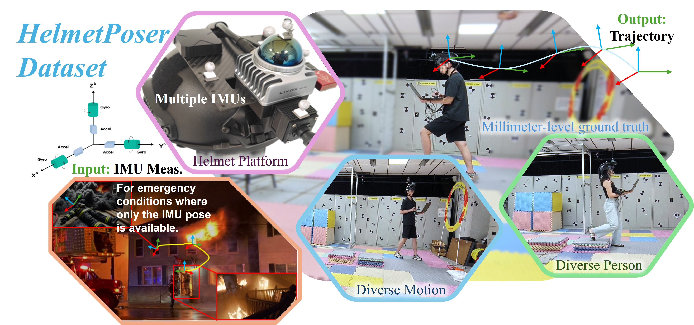
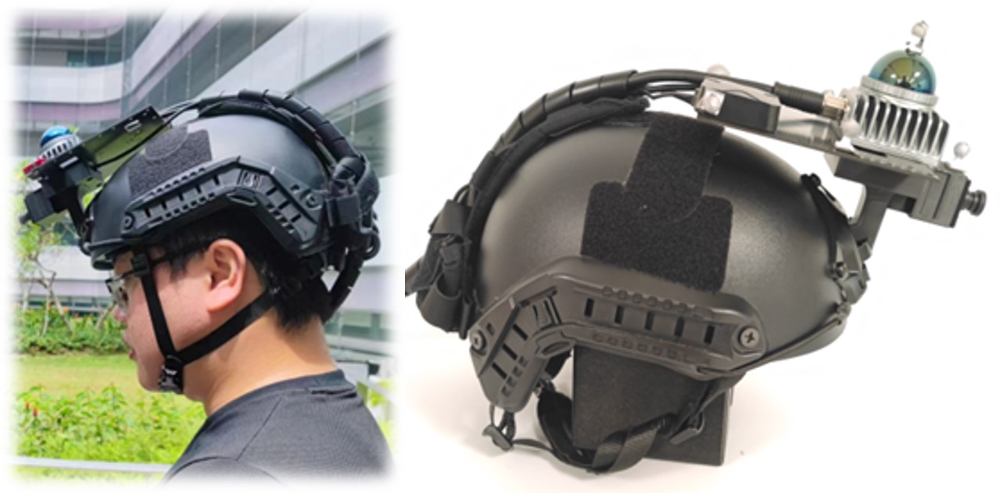
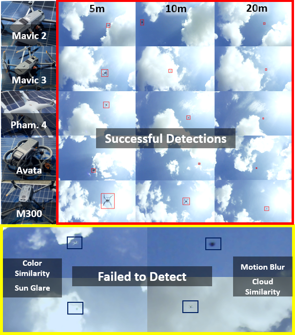

<p align="center">
    
</p>

# [HelmetPoser: A Helmet-Mounted IMU Dataset for Data-Driven Estimation of Human Head Motion in Diverse Conditions](https://github.com/LQIUTONG/HelmetPoser.github.io)


The hardware diagram of HelMet Poser is shown as follows:

<p align="center">
    
</p>

* Livox Mid 360 Lidar IMU
* VectorNav VN100 IMU


The dataset recording for the three actions was completed by 10 participants as shown below.

<div style="display: flex; justify-content: center; gap: 0;">
  
  
  
</div>

# Downloads

Our dataset for this study can be downloaded directly through [this link](https://drive.google.com/drive/folders/17zXelc3acoyY49U6o2rZdKZ3fnDUKN4L?usp=sharing).

<!--
Note: The files below are hosted on [NTU Data Repository](https://researchdata.ntu.edu.sg/dataset.xhtml?persistentId=doi:10.21979/N9/X39LEK).
If you experience interruption from the NTU Data Repository, please try downloading the files from this [Onedrive folder](https://entuedu-my.sharepoint.com/:f:/g/personal/shyuan_staff_main_ntu_edu_sg/EvyxXbi1l5tHonBWIQxueBoByr1-E-w7fgRyHNTsCmwFcg).

Ground truth is included in the separate bag. Do check out [this example](https://github.com/brytsknguyen/VINS-Mono/blob/392c8c5732d31445b266b9ca2e2f38a5a4d82d55/vins_estimator/launch/run_one_bag_ntuviral.sh#L68) on how to extract the data into the csv format.
-->

<!-- The files below are hosted on OneDrive. If you are having a problem downloading from one drive, do raise an issue. 
 
Note: All rosbag data has been compressed using 'rosbag compress' to reduce its size by a factor of 3. If you directly run 'rosbag play,' the playback frequency will be reduced. To restore the bag to its full rate, please use the 'rosbag decompress' command.


<a name="tab-download"></a>
<style type="text/css">
.tg  {border-collapse:collapse;border-spacing:0;}
.tg td{border-color:black;border-style:solid;border-width:1px;font-family:Arial, sans-serif;font-size:14px;
  overflow:hidden;padding:10px 5px;word-break:normal;}
.tg th{border-color:black;border-style:solid;border-width:1px;font-family:Arial, sans-serif;font-size:14px;
  font-weight:normal;overflow:hidden;padding:10px 5px;word-break:normal;}
.tg .tg-6ibf{border-color:inherit;font-size:18px;text-align:center;vertical-align:top}
.tg .tg-v8dz{border-color:inherit;font-size:18px;text-align:left;vertical-align:top}
.tg .tg-9m02{border-color:inherit;color:#00E;font-size:18px;text-align:center;text-decoration:underline;vertical-align:top}
</style>
<table class="tg">
<thead>
  <tr>
    <th class="tg-6ibf">Name</th>
    <th class="tg-6ibf">ROSBag Data</th>
    <th class="tg-6ibf">Folder Data</th>
    <th class="tg-6ibf">Ground truth</th>
    <th class="tg-6ibf">Size</th>
    <th class="tg-6ibf">Duration</th>
    <th class="tg-6ibf">Remark</th>
  </tr>
</thead>
<tbody>
  <tr>
    <td class="tg-v8dz">DJI Mavic2</td>
    <td class="tg-6ibf"><a href="https://entuedu-my.sharepoint.com/:u:/g/personal/shyuan_staff_main_ntu_edu_sg/Eb-_jzBSOhpNquYUpcZZeyEB4jf-35RJEkUYMZVj80WMiw?e=FBn0q9" target="_blank" rel="noopener noreferrer">.bag</a></td>
    <td class="tg-9m02"><a href="https://entuedu-my.sharepoint.com/:u:/g/personal/shyuan_staff_main_ntu_edu_sg/ESfINWq7uCpKkjH3YhEGZ24BmyKhcgFfF09dTZYte-C-0g?e=mww8va" target="_blank" rel="noopener noreferrer">.zip</a></td>
    <td class="tg-6ibf"><a href="https://entuedu-my.sharepoint.com/:u:/g/personal/shyuan_staff_main_ntu_edu_sg/EW4eZm1eEm9FndMN8hxQyesBNdQny6iV_n86Jtwcysi7Lw?e=s8csWh" target="_blank" rel="noopener noreferrer">.bag</a></td>
    <td class="tg-6ibf">14.1 GB</td>
    <td class="tg-6ibf">198s</td>
    <td class="tg-v8dz">MMAUD V1 Rooftop Simple </td>
  </tr>
  <tr>
    <td class="tg-v8dz">DJI Mavic3</td>
    <td class="tg-9m02"><a href="https://entuedu-my.sharepoint.com/:u:/g/personal/shyuan_staff_main_ntu_edu_sg/EVqEQlvzM25Lm_q-W6G1wIsBrJWBj2O6mfLbLZ_SCkbb_w?e=EIWBxX" target="_blank" rel="noopener noreferrer">.bag</a></td>
    <td class="tg-9m02"><a href="https://entuedu-my.sharepoint.com/:u:/g/personal/shyuan_staff_main_ntu_edu_sg/ETe4YTM-IKdMnA11Q1Dv_PgBWGfQ38iwYoFpkFWthhfJsQ?e=CJU8JN" target="_blank" rel="noopener noreferrer">.zip</a></td>
    <td class="tg-6ibf"><a href="https://entuedu-my.sharepoint.com/:u:/g/personal/shyuan_staff_main_ntu_edu_sg/Eaol9EuQTZ5BmYffvBSo3kIB0DwKDcYstGvwg-Qrtnts4A?e=ZaJpsa" target="_blank" rel="noopener noreferrer">.bag</a></td>
    <td class="tg-6ibf">11.1 GB</td>
    <td class="tg-6ibf">321.1 s</td>
    <td class="tg-v8dz">MMAUD V1 Rooftop Simple</td>
  </tr>
  <tr>
    <td class="tg-v8dz">DJI Phantom4</td>
    <td class="tg-9m02"><a href="https://entuedu-my.sharepoint.com/:u:/g/personal/shyuan_staff_main_ntu_edu_sg/EUvtDQtIou5Otv4S1kFZ4ikBPCypxqpYSZ8onr5BCPpG8w?e=hlbBBz" target="_blank" rel="noopener noreferrer">.bag</a></td>
    <td class="tg-9m02"><a href="https://entuedu-my.sharepoint.com/:u:/g/personal/shyuan_staff_main_ntu_edu_sg/ERY9v7zK3hxLtxqHKVa8aDgBDSji1W_1LFeYiXN9FKJMnA?e=sTaDCI" target="_blank" rel="noopener noreferrer">.zip</a></td>
    <td class="tg-6ibf"><a href="https://entuedu-my.sharepoint.com/:u:/g/personal/shyuan_staff_main_ntu_edu_sg/EYlHSi2RmehBoPYDXiKspL0BsYx0IDXFtmG_UcFRl_AKBQ?e=B7KLP3" target="_blank" rel="noopener noreferrer">.bag</a></td>
    <td class="tg-6ibf">13.2 GB</td>
    <td class="tg-6ibf">181.4 s</td>
    <td class="tg-v8dz">MMAUD V1 Rooftop Simple</td>
  </tr>
  <tr>
    <td class="tg-v8dz">DJI Avata</td>
    <td class="tg-9m02"><a href="https://entuedu-my.sharepoint.com/:u:/g/personal/shyuan_staff_main_ntu_edu_sg/ETqBudcomxlMn_ClHROwLLAB_5XP5t_elNcU2B7siU-1RQ?e=bYrzOi" target="_blank" rel="noopener noreferrer">.bag</a></td>
    <td class="tg-9m02"><a href="https://entuedu-my.sharepoint.com/:u:/g/personal/shyuan_staff_main_ntu_edu_sg/EU-kJE4eYctGkb6VOif4JEwBwSRjUpcWjFaDc4D-v-mUrA?e=Uxpq5y" target="_blank" rel="noopener noreferrer">.zip</a></td>
    <td class="tg-6ibf"><a href="https://entuedu-my.sharepoint.com/:u:/g/personal/shyuan_staff_main_ntu_edu_sg/EYoZq-lAmvVMgncDhDX4MDIBy6_mqqobYE1WW8xQ7EhfxQ?e=QJqwJc" target="_blank" rel="noopener noreferrer">.bag</a></td>
    <td class="tg-6ibf">19.7 GB</td>
    <td class="tg-6ibf">396.3 s</td>
    <td class="tg-v8dz">MMAUD V1 Rooftop Simple</td>
  </tr>
  <tr>
    <td class="tg-v8dz">DJI M300</td>
    <td class="tg-9m02"><a href="https://entuedu-my.sharepoint.com/:u:/g/personal/shyuan_staff_main_ntu_edu_sg/EeA7KMRCRNBNvbP50UsPmJ0B0PEGEk71L6FpHkQSKncabQ?e=U90Es9" target="_blank" rel="noopener noreferrer">.bag</a></td>
    <td class="tg-9m02"><a href="https://entuedu-my.sharepoint.com/:u:/g/personal/shyuan_staff_main_ntu_edu_sg/EacBt-X3QERBvH0Gw1d3kbMB7VECC1ATgSZHWFYzuUjGuA?e=nmBbUg" target="_blank" rel="noopener noreferrer">.zip</a></td>
    <td class="tg-6ibf"><a href="https://entuedu-my.sharepoint.com/:u:/g/personal/shyuan_staff_main_ntu_edu_sg/ERDR8BNyj0hBrmsCIg8rP8wBnmz52qq4WTqjkCc2dnUQAw?e=KkXYhl" target="_blank" rel="noopener noreferrer">.bag</a></td>
    <td class="tg-6ibf">14.4 GB</td>
    <td class="tg-6ibf">428.7 s</td>
    <td class="tg-v8dz">MMAUD V1 Rooftop Simple</td>
  </tr>


  <tr>
    <td class="tg-v8dz">DJI Mavic3</td>
    <td class="tg-9m02"><a href=" " target="_blank" rel="noopener noreferrer">.bag</a></td>
    <td class="tg-9m02"><a href=" " target="_blank" rel="noopener noreferrer">.zip</a></td>
    <td class="tg-6ibf"><a href=" " target="_blank" rel="noopener noreferrer">.bag</a></td>
    <td class="tg-6ibf">?? GB</td>
    <td class="tg-6ibf">?? s</td>
    <td class="tg-v8dz">MMAUD V2 Carpark Hard</td>
  </tr>
  <tr>
    <td class="tg-v8dz">DJI Phantom4</td>
    <td class="tg-9m02"><a href=" " target="_blank" rel="noopener noreferrer">.bag</a></td>
    <td class="tg-9m02"><a href=" " target="_blank" rel="noopener noreferrer">.zip</a></td>
    <td class="tg-6ibf"><a href=" " target="_blank" rel="noopener noreferrer">.bag</a></td>
    <td class="tg-6ibf">?? GB</td>
    <td class="tg-6ibf">?? s</td>
    <td class="tg-v8dz">MMAUD V2 Carpark Hard</td>
  </tr>
  <tr>
    <td class="tg-v8dz">DJI Avata</td>
    <td class="tg-9m02"><a href=" " target="_blank" rel="noopener noreferrer">.bag</a></td>
    <td class="tg-9m02"><a href=" " target="_blank" rel="noopener noreferrer">.zip</a></td>
    <td class="tg-6ibf"><a href=" " target="_blank" rel="noopener noreferrer">.bag</a></td>
    <td class="tg-6ibf">?? GB</td>
    <td class="tg-6ibf">?? s</td>
    <td class="tg-v8dz">MMAUD V2 Carpark Hard</td>
  </tr>
  <tr>
    <td class="tg-v8dz">DJI M300</td>
    <td class="tg-9m02"><a href=" " target="_blank" rel="noopener noreferrer">.bag</a></td>
    <td class="tg-9m02"><a href=" " target="_blank" rel="noopener noreferrer">.zip</a></td>
    <td class="tg-6ibf"><a href=" " target="_blank" rel="noopener noreferrer">.bag</a></td>
    <td class="tg-6ibf">?? GB</td>
    <td class="tg-6ibf">?? s</td>
    <td class="tg-v8dz">MMAUD V2 Carpark Hard</td>
  </tr>


  <tr>
    <td class="tg-v8dz">DJI Mavic3</td>
    <td class="tg-9m02"><a href=" " target="_blank" rel="noopener noreferrer">.bag</a></td>
    <td class="tg-9m02"><a href=" " target="_blank" rel="noopener noreferrer">.zip</a></td>
    <td class="tg-6ibf"><a href=" " target="_blank" rel="noopener noreferrer">.bag</a></td>
    <td class="tg-6ibf">?? GB</td>
    <td class="tg-6ibf">?? s</td>
    <td class="tg-v8dz">MMAUD V3 Carpark Moderate</td>
  </tr>
  <tr>
    <td class="tg-v8dz">DJI Phantom4</td>
    <td class="tg-9m02"><a href=" " target="_blank" rel="noopener noreferrer">.bag</a></td>
    <td class="tg-9m02"><a href=" " target="_blank" rel="noopener noreferrer">.zip</a></td>
    <td class="tg-6ibf"><a href=" " target="_blank" rel="noopener noreferrer">.bag</a></td>
    <td class="tg-6ibf">?? GB</td>
    <td class="tg-6ibf">?? s</td>
    <td class="tg-v8dz">MMAUD V3 Carpark Moderate</td>
  </tr>
  <tr>
    <td class="tg-v8dz">DJI Avata</td>
    <td class="tg-9m02"><a href=" " target="_blank" rel="noopener noreferrer">.bag</a></td>
    <td class="tg-9m02"><a href=" " target="_blank" rel="noopener noreferrer">.zip</a></td>
    <td class="tg-6ibf"><a href=" " target="_blank" rel="noopener noreferrer">.bag</a></td>
    <td class="tg-6ibf">?? GB</td>
    <td class="tg-6ibf">?? s</td>
    <td class="tg-v8dz">MMAUD V3 Carpark Moderate</td>
  </tr>
  <tr>
    <td class="tg-v8dz">DJI M300</td>
    <td class="tg-9m02"><a href=" " target="_blank" rel="noopener noreferrer">.bag</a></td>
    <td class="tg-9m02"><a href=" " target="_blank" rel="noopener noreferrer">.zip</a></td>
    <td class="tg-6ibf"><a href=" " target="_blank" rel="noopener noreferrer">.bag</a></td>
    <td class="tg-6ibf">?? GB</td>
    <td class="tg-6ibf">?? s</td>
    <td class="tg-v8dz">MMAUD V3 Carpark Moderate</td>
  </tr>
    
</tbody>
</table> -->

<!-- # Quick use

We have done some experiments of state-of-the-art methods on our the datasets. If you are seeking to do the same, please check out the following to get the work done quickly.


<style type="text/css">
.tg  {border-collapse:collapse;border-spacing:0;}
.tg td{border-color:black;border-style:solid;border-width:1px;font-family:Arial, sans-serif;font-size:14px;
  overflow:hidden;padding:10px 5px;word-break:normal;}
.tg th{border-color:black;border-style:solid;border-width:1px;font-family:Arial, sans-serif;font-size:14px;
  font-weight:normal;overflow:hidden;padding:10px 5px;word-break:normal;}
.tg .tg-c3ow{border-color:inherit;text-align:center;vertical-align:top}
.tg .tg-0pky{border-color:inherit;text-align:left;vertical-align:top}
</style>
<table class="tg">
<thead>
  <tr>
    <th class="tg-c3ow">2D Detection</th>
    <th class="tg-c3ow">Repository</th>
    <th class="tg-c3ow">Credit</th>
  </tr>
</thead>
<tbody>
  <tr>
    <td class="tg-0pky">YoloV5</td>
    <td class="tg-0pky"> <a href="Paper under Review, not yet open"><span style="color:#905">Paper under Review, not yet open</span></a></td>
    <td class="tg-0pky">Forked from https://github.com/ultralytics/yolov5</td>
  </tr>
  <tr>
    <td class="tg-0pky">YoloX</td>
    <td class="tg-0pky"> <a href="Paper under Review, not yet open"><span style="color:#905">Paper under Review, not yet open</span></a></td>
    <td class="tg-0pky">Forked from https://github.com/Megvii-BaseDetection/YOLOX</td>
  </tr>
  <tr>
    <td class="tg-0pky">CenterNet</td>
    <td class="tg-0pky"> <a href="Paper under Review, not yet open"><span style="color:#905">Paper under Review, not yet open</span></a></td>
    <td class="tg-0pky">Forked from https://github.com/xingyizhou/CenterNet</td>
  </tr>
  <tr>
    <td class="tg-0pky">SSD</td>
    <td class="tg-0pky"> <a href="Paper under Review, not yet open"><span style="color:#905">Paper under Review, not yet open</span></a></td>
    <td class="tg-0pky">Forked from https://github.com/amdegroot/ssd.pytorch</td>
  </tr>
  <tr>
    <td class="tg-0pky">M2Det</td>
    <td class="tg-0pky"> <a href="Paper under Review, not yet open"><span style="color:#905">Paper under Review, not yet open</span></a></td>
    <td class="tg-0pky">Forked from https://github.com/VDIGPKU/M2Det</td>
  </tr>
</tbody>
</table>


<p align="center">
    
</p>
<p align="center">
    
</p>

<style type="text/css">
.tg  {border-collapse:collapse;border-spacing:0;}
.tg td{border-color:black;border-style:solid;border-width:1px;font-family:Arial, sans-serif;font-size:14px;
  overflow:hidden;padding:10px 5px;word-break:normal;}
.tg th{border-color:black;border-style:solid;border-width:1px;font-family:Arial, sans-serif;font-size:14px;
  font-weight:normal;overflow:hidden;padding:10px 5px;word-break:normal;}
.tg .tg-c3ow{border-color:inherit;text-align:center;vertical-align:top}
.tg .tg-0pky{border-color:inherit;text-align:left;vertical-align:top}
</style>
<table class="tg">
<thead>
  <tr>
    <th class="tg-c3ow">3D Pose Estimation</th>
    <th class="tg-c3ow">Repository</th>
    <th class="tg-c3ow">Credit</th>
  </tr>
</thead>
<tbody>
  <tr>
    <td class="tg-0pky">ResNet</td>
    <td class="tg-0pky"> <a href="Paper under Review, not yet open"><span style="color:#905">Paper under Review, not yet open</span></a></td>
    <td class="tg-0pky">Forked from https://github.com/Lornatang/ResNet-PyTorch</td>
  </tr>
  <tr>
    <td class="tg-0pky">VGG</td>
    <td class="tg-0pky"> <a href="Paper under Review, not yet open"><span style="color:#905">Paper under Review, not yet open</span></a></td>
    <td class="tg-0pky">Forked from https://github.com/Lornatang/VGG-PyTorch</td>
  </tr>
  <tr>
    <td class="tg-0pky">Darknet</td>
    <td class="tg-0pky"> <a href="Paper under Review, not yet open"><span style="color:#905">Paper under Review, not yet open</span></a></td>
    <td class="tg-0pky">Forked from https://github.com/pjreddie/darknet</td>
  </tr>
  <tr>
    <td class="tg-0pky">Audio Transformer</td>
    <td class="tg-0pky"> <a href="Paper under Review, not yet open"><span style="color:#905">Paper under Review, not yet open</span></a></td>
    <td class="tg-0pky">Reimplemented</td>
  </tr>
  <tr>
    <td class="tg-0pky">VorasNet</td>
    <td class="tg-0pky"> <a href="Paper under Review, not yet open"><span style="color:#905">Paper under Review, not yet open</span></a></td>
    <td class="tg-0pky">Reimplemented</td>
  </tr>
</tbody>
</table>


# CAD drawing for dataset expansion


The [CAD drawing](https://github.com/ntu-aris/MMAUD/blob/gh-pages/drawing.rar) can be found here.

Since there are multiple ethernet devices. It is recommended to set 2 livox lidar and MMwave radar to be at 192.168.10.xx , 192.168.11.xx , and 192.168.12.xx.

The microphone and camera can be obtained from Taobao. Whereas other LIDAR and RADAR need to find your local distributor to get it. 

If you have any issues in recreating this rig, feel free to drop an issue in this dataset repo -->

# Notes:
<!-- For more information on the sensors and how to use the dataset, please checkout the other sections.

For resources and other works of our group please checkout our [github](https://github.com/ntu-aris). -->

If you have some inquiry, please raise an [issue](https://github.com/LQIUTONG/HelmetPoser.github.io/issues) on github.

# Citation
If you use some resource from this data suite, please cite it as

```

```

# Licence
